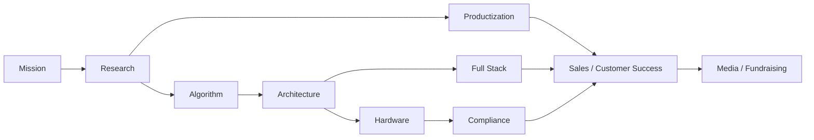

# WearEdge Agent Team

[](https://github.com/davidmillerak2026-sys/Agentic_AI_team/actions/workflows/tests.yml)

AI-native solo-founder operating system for Ryan Hui and WearEdge Pro.

This repository turns the "one founder + nine AI agents" idea into runnable code. The team can research markets, optimize edge AI algorithms, design distributed architecture, build software, reason about hardware manufacturability, productize industrial workflows, check compliance, prepare customer success work, and write media or fundraising narratives.

WearEdge Pro can use this repository as an external agent-team hub instead of storing the team logic inside the main product repository.

## The Nine Agents

| Agent ID | Agent | Core Role |
| --- | --- | --- |
| `research` | 调研 Agent / Research Scout | Market, GitHub, policy, paper, competitor, and customer-pain research |
| `algorithm` | 算法优化 Agent / Model Optimization Lead | Edge model, RAG, quantization, schema, latency, and evaluation |
| `architecture` | 分布式架构 Agent / Distributed Systems Architect | Edge/gateway/cloud boundaries, workflow orchestration, enterprise integration |
| `fullstack` | 全栈开发 Agent / Full Stack Builder | CLI, API, console, demos, tests, and delivery surfaces |
| `hardware` | 硬件可制造性 Agent / DFM Hardware Lead | BOM, power, thermal, structure, supplier, and DFM risk |
| `productization` | 工业场景产品化 Agent / Industrial Product Manager | SOP, IQC, inspection, maintenance, work orders, and acceptance metrics |
| `compliance` | 合规与安全认证 Agent / Compliance and Safety Gatekeeper | Local deployment, data security, safety boundary, audit log, certification gaps |
| `sales` | 销售 BD 与客户成功 Agent / BD and Customer Success Lead | PoC scope, ROI, proposal, customer success, and follow-up |
| `media` | 自媒体与融资叙事 Agent / Media and Fundraising Storyteller | README, launch post, short video script, pitch narrative, investor Q&A |

## Quick Start

```powershell
python -m venv .venv
.\.venv\Scripts\Activate.ps1
pip install -e .
wearedge-team list
wearedge-team run "为 WearEdge Pro 设计一个工业 AR 实时质检 PoC"
```

Run selected agents only:

```powershell
wearedge-team run "准备灯塔客户 PoC 方案" --agent research --agent productization --agent sales
```

Add evidence files:

```powershell
wearedge-team run "把 IQC 视觉检查做成可交付 Demo" --evidence examples/wear-edge-context.md --agent research --agent productization --agent sales
```

Emit JSON:

```powershell
wearedge-team run "准备融资路演叙事" --agent media --json
```

## Architecture



The runtime is intentionally small and local-first:

- `AgentDefinition`: stable role contract, required fields, artifacts, and handoffs.
- `RoleAgent`: builds the role prompt and produces a deterministic fallback output.
- `AgentTeam`: runs selected agents and passes outputs through a blackboard.
- `TeamReport`: exports Markdown or JSON for GitHub issues, investor notes, PoC plans, or founder logs.

## Optional LLM Provider

By default, the project uses an offline deterministic planner. It works without a model server or cloud API.

For OpenAI-compatible local or enterprise endpoints:

```powershell
$env:OPENAI_COMPATIBLE_BASE_URL="http://localhost:8000/v1"
$env:OPENAI_COMPATIBLE_API_KEY="local-key"
wearedge-team run "准备融资路演叙事" --provider openai-compatible --model local-model
```

## Development

```powershell
python -m unittest discover -s tests
```

## References

This repository is inspired by practical multi-agent engineering patterns found in industrial AI and R&D automation projects, including:

- `choukha/industrial-ai-agents`
- `microsoft/RD-Agent`
- industrial RAG and MCP-style agent projects around maintenance, SOP, and shop-floor integration
