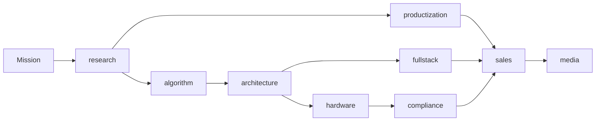

# Workflow

The runtime uses a blackboard pattern.

Each agent receives:

- the founder mission
- optional context
- optional constraints
- optional evidence files
- runtime data from prior agents

Each agent emits:

- a compact role-specific brief
- required fields
- handoff target
- optional evidence references

The current implementation is synchronous and dependency-free so it can run anywhere. The boundaries are intentionally compatible with a future async TriggerFlow implementation: each agent can become a chunk, and `runtime_data` can become the flow blackboard.
